<picture>
  <source media="(prefers-color-scheme: dark)" srcset="dark.svg">
  <source media="(prefers-color-scheme: light)" srcset="light.svg">
  
</picture>

 

## About Me

Ambitious BBIS student (8th semester, University of Management and Technology, Lahore) with hands-on experience across front-end development, IT support, database systems, and business process analysis. Comfortable across the full stack of a small dev/BI toolkit — from `HTML`/`CSS`/`JS` to `SQL`, `Power BI`, and `Odoo ERP` — with a detail-oriented, collaborative approach proven on both academic and client work.

- 🎓 **BBIS**, University of Management and Technology (UMT) — Nov 2022 – Aug 2026
- 🚀 **Capstone Project**: *Artisan Aura Creations* — an Odoo ERP–powered sustainable leather goods brand, one of only **3 projects selected** for exhibition at ICAISAI'26 (HSM–UMT)
- 📍 Based in Iqbal Town, Lahore, Pakistan
- 💬 Fluent in English & Urdu

 

## 🛠️ Skills

**Languages & Web**

**Data, BI & Databases**

**ERP & Business Tools**

-0052CC?style=for-the-badge&logo=jira&logoColor=white)

**Design & Productivity**

 

## 💼 Experience

**Front End Intern** · Tara Technologies Pvt. Ltd. (On-site, Lahore) · *Jul 2023 – Sep 2023*
Designed and coded interfaces using Photoshop, Illustrator, Figma, HTML, CSS and Java, collaborating via GitHub on real client projects.

**HR Internee** · MGA Industries Pvt. Ltd. (On-site, Manga Mandi, Lahore) · *Aug 2025 – Sep 2025*
Supported talent acquisition (CV screening, interview scheduling) and new-hire onboarding; maintained employee records and processed payroll data using the Oracle HR database.

**Data Annotator** · Nex Pred Solutions (Remote) · *Feb 2026 – Mar 2026*
Prepared video datasets for computer vision — frame extraction, filtration, and YOLO ↔ COCO annotation conversion — managing labeling and QA workflows in CVAT.

 

## 🚧 Featured Projects

### 🧵 Artisan Aura Creations — Sustainable Leather Goods Brand *(Odoo ERP)*
Final-year capstone building a direct-to-consumer, ethically sourced leather goods brand end-to-end on Odoo ERP — integrating CRM, HR, Sales, and Inventory into unified procurement, marketing, and production workflows. Selected as **1 of 3 projects** exhibited at the ICAISAI'26 Project Exhibition Competition and evaluated by industry professionals.

### 🗄️ Student Registration & Library Management Database Design
Structured database design (Oracle) for a student registration system covering department allocation, sectioning, fee tracking, and eligibility checks, with ER diagrams mapping relationships between students, advisors, instructors, and departments for accuracy and data integrity.

 

## 🏆 Awards & Recognition

- 🥇 **Project Exhibition Selectee**, ICAISAI'26 (HSM, UMT) — 1 of only 3 projects selected, evaluated by a DevOps & Cloud industry expert
- 🧩 **Capstone Project Lead**, Artisan Aura Creations — full-scale Odoo ERP system integrating CRM, HR, Sales & Inventory
- ⭐ **Recognized Intern**, Tara Technologies — for UI/UX design and front-end contributions on live client projects
- 📜 **Multi-Platform Certified** — Google, Microsoft, IBM, SAP, Coursera, Simplilearn
- 👥 **Team Leader**, Academic Design & Tech Projects — interface design, user journey mapping, cross-functional delivery

 

## 📜 Certifications

| Certification | Provider | Date |
|---|---|---|
| Microsoft Power BI (Data Analysis & Visualization) | Uni Athena / Cambridge International | Apr 2025 |
| WordPress (Building Websites) | Coursera | Apr 2025 |
| Canva (Graphic Design) | Simplilearn | Apr 2025 |
| IT Automation with Python | Google | Jun 2025 |
| Managing Basic Business Scenarios | SAP | Jun 2025 |
| Odoo 14 Essentials | Odoo | Jun 2025 |
| Foundations of Project Management | Google | Jul 2025 |
| Developing Interpersonal Skills | IBM | Jul 2025 |
| Jira SCRUM Project | Coursera | Jul 2025 |

 

## 📫 Let's Connect

References available upon request.

