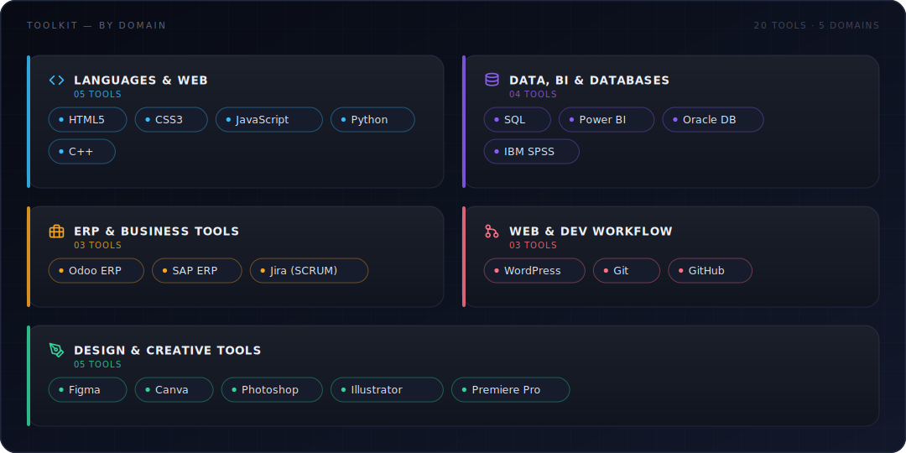
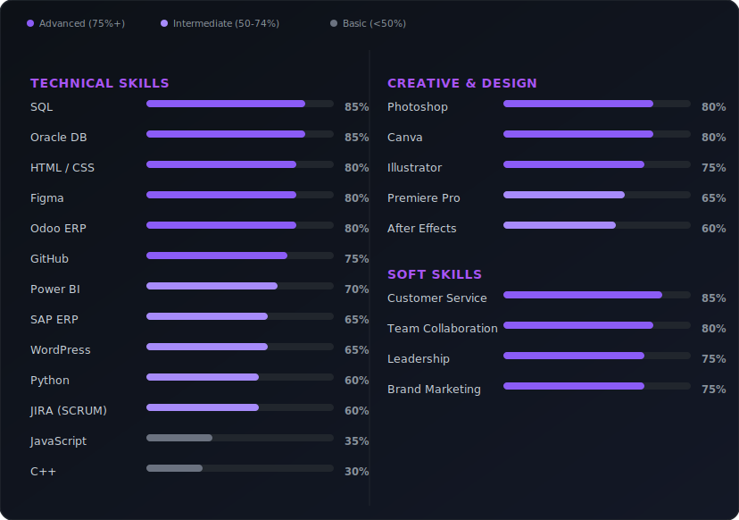

<div align="center">

<br/>

<p align="center">
  
  &nbsp;
  
  &nbsp;
  
  &nbsp;
  
  &nbsp;
  
</p>

<br/>

<p align="center">
  
</p>

</div>

<br>

## 🟣 About Me

I'm an ambitious **BBIS (Bachelor of Business Information Systems)** student at UMT, Lahore (Class of 2026), with a strong passion for **frontend engineering, business intelligence, and enterprise systems**. I bring hands-on experience across **IT support, database design, ERP implementation, and UI/UX**, blending technical execution with a **product and business-strategy mindset**.

- 🎨 Frontend development with HTML, CSS, JavaScript (Basic), WordPress & Figma
- 📊 Business Intelligence & data visualization using **Power BI**, **SQL**, and **Oracle DB**
- 🏢 Enterprise systems experience with **Odoo ERP** and **SAP ERP** (Financial & Supply Chain)
- 🎬 Creative & design toolkit  Canva, Photoshop, Illustrator, Premiere Pro, After Effects, Audition, Draw.io
- 🧩 Detail-oriented, collaborative, and outcome-driven across academic and real-world projects

**🟢 Open To:** Frontend Development Roles · Business Intelligence & Data Analyst Roles · ERP/CRM Implementation · Internships & Junior Engineering Positions

<br>

<div align="center">

| | |
|:--|:--|
| 🎓 **Education** | BBIS, University of Management and Technology  Nov 2022 – Aug 2026 |
| 🚀 **Capstone** | *Artisan Aura Creations*  Odoo ERP powered sustainable leather goods brand, 1 of 3 projects selected for ICAISAI'26 exhibition |
| 📍 **Location** | Lahore, Pakistan |
| 💬 **Languages** | English (fluent) · Urdu (fluent) |

</div>

<br>


## 🟣 Skills

<div align="center">



</div>

<br>


## 🟣 Skill Proficiency Scale

<div align="center">



</div>

<br>


## 💼 Professional Experience

<table width="100%">
<tr>
<td width="30%" valign="top">
  <h3>🎨 Front-End Development Intern</h3>
  <b>Tara Technologies Pvt. Ltd.</b><br>
  📍 On-site, Lahore, Pakistan<br>
  🗓️ Jul 2023 – Sep 2023
  <br><br>
  
  
  
</td>
<td valign="top">
  Engineered responsive, user-centric web interfaces for live client projects, translating high-fidelity designs from <b>Figma</b>, <b>Photoshop</b>, and <b>Illustrator</b> into production-ready <b>HTML</b> and <b>CSS</b>.
  <br><br>
  Collaborated cross-functionally with the engineering team through <b>Git/GitHub</b> version control workflows — participating in code reviews and iterative UI refinements to ensure pixel-perfect, cross-browser consistency.
</td>
</tr>

<tr><td colspan="2"><hr></td></tr>

<tr>
<td width="30%" valign="top">
  <h3>🧑‍💼 Human Resources Intern</h3>
  <b>MGA Industries Pvt. Ltd.</b><br>
  📍 On-site, Manga Mandi, Lahore<br>
  🗓️ Aug 2025 – Sep 2025
  <br><br>
  
  
  
</td>
<td valign="top">
  Drove end-to-end talent acquisition for a manufacturing enterprise — including CV screening, candidate shortlisting, and interview coordination — resulting in streamlined hiring turnaround.
  <br><br>
  Managed new-hire onboarding and maintained accurate, audit-ready employee records within the <b>Oracle HR</b> database, while processing payroll data and monitoring regulatory compliance to ensure data integrity across HR operations.
</td>
</tr>

<tr><td colspan="2"><hr></td></tr>

<tr>
<td width="30%" valign="top">
  <h3>🤖 Data Annotation Specialist</h3>
  <b>Nex Pred Solutions</b><br>
  📍 Remote, Lahore<br>
  🗓️ Feb 2026 – Mar 2026
  <br><br>
  
  
  
</td>
<td valign="top">
  Built and curated high-quality video datasets to support computer vision model training, performing systematic video filtration and frame extraction at scale.
  <br><br>
  Executed precise annotation conversions between <b>YOLO</b> and <b>COCO</b> formats, managed structured labeling workflows in <b>CVAT</b>, and conducted rigorous validation and QA checks — directly improving the reliability and performance of downstream ML models.
</td>
</tr>
</table>

<br>


## 🟣 Featured Projects

<details open>
<summary><b>🛍️ Artisan Aura Creations  Sustainable Leather Goods Brand (Odoo ERP)</b></summary>
<br/>

Capstone & exhibition project: a direct-to-consumer brand redefining sustainable, ethically sourced leather goods, selected as one of only 3 projects exhibited at **ICAISAI'26 (HSM–UMT)** and evaluated by industry professionals.

| Aspect | Details |
|:--|:--|
| **Stack** | Odoo ERP (CRM, HR, Sales, Inventory) |
| **Scale** | Full-scale simulated business operations |
| **Workflows** | End-to-end procurement, marketing & production workflows |
| **Governance** | Role-based ERP access & data integrity controls |
| **Impact** | 1 of 3 projects exhibited at ICAISAI'26, evaluated by industry professionals |
| **Vision** | Grow into a global leader in ethical luxury, setting new standards for responsible craftsmanship |
| **Repository** | Available upon request |

Designed end-to-end workflows across procurement, marketing, and production while championing eco-conscious, ethically sourced fashion  with a long-term vision of scaling into a global leader in ethical luxury craftsmanship.

</details>

<details>
<summary><b>🗄️ Student Registration & Library Management Database System</b></summary>
<br/>

A structured Oracle-based database system designed using conceptual and logical modeling for student registration and library management.

| Aspect | Details |
|:--|:--|
| **Stack** | Oracle Database, ER Modeling |
| **Scale** | Institution-wide registration & library workflows |
| **Processes Covered** | Department allocation, sectioning, fee tracking, eligibility checks |
| **Integrity** | Referential integrity & eligibility validation checks |
| **Impact** | Efficient department allocation, sectioning, and fee tracking |
| **Repository** | Available upon request |

Mapped relationships between students, advisors, instructors, and departments via ER diagrams, ensuring accuracy and system integrity throughout the registration process.

</details>

<br>


## 🟣 Awards & Recognition

| | |
|:--|:--|
| 🥇 **Project Exhibition Selectee** | ICAISAI'26, HSM UMT  1 of only 3 projects selected for exhibition; evaluated by a DevOps & Cloud industry expert from Nex Skill |
| 🧩 **Capstone Project Lead** | Artisan Aura Creations, UMT  built a full-scale Odoo ERP system for a sustainable leather brand, integrating CRM, HR, Sales, and Inventory |
| ⭐ **Recognized Intern** | Tara Technologies Pvt. Ltd.  recognized for UI/UX design and front-end contributions on live client projects |
| 📜 **Multi-Platform Certified** | Google, Microsoft, IBM, SAP, Coursera, Simplilearn  certifications in IT Automation, Power BI, SAP, ERP, and Project Management |
| 👥 **Team Leader** | Academic Design & Tech Projects  led university teams through interface design, user journey mapping, and cross-functional delivery |

<br>

## 📜 Certifications & Professional Development

<div align="center">

<table width="95%">
<thead>
<tr>
<th align="center">Certification</th>
<th align="center">Category</th>
<th align="center">Issuing Organization</th>
<th align="center">Date</th>
</tr>
</thead>
<tbody>
<tr>
<td align="center"><b>Microsoft Power BI</b><br><sub>Data Analysis & Visualization</sub></td>
<td align="center">Data & Analytics</td>
<td align="center">Uni Athena / Cambridge International</td>
<td align="center">Apr 2025</td>
</tr>
<tr>
<td align="center"><b>IT Automation with Python</b></td>
<td align="center">Data & Analytics</td>
<td align="center">Google</td>
<td align="center">Jun 2025</td>
</tr>
<tr>
<td align="center"><b>WordPress</b><br><sub>Building Websites</sub></td>
<td align="center">Design & Web Development</td>
<td align="center">Coursera</td>
<td align="center">Apr 2025</td>
</tr>
<tr>
<td align="center"><b>Canva</b><br><sub>Graphic Design</sub></td>
<td align="center">Design & Web Development</td>
<td align="center">Simplilearn</td>
<td align="center">Apr 2025</td>
</tr>
<tr>
<td align="center"><b>SAP</b><br><sub>Managing Basic Business Scenarios</sub></td>
<td align="center">Business & Enterprise Systems</td>
<td align="center">SAP</td>
<td align="center">Jun 2025</td>
</tr>
<tr>
<td align="center"><b>Odoo 14 Essentials</b></td>
<td align="center">Business & Enterprise Systems</td>
<td align="center">Odoo</td>
<td align="center">Jun 2025</td>
</tr>
<tr>
<td align="center"><b>Foundations of Project Management</b></td>
<td align="center">Business & Enterprise Systems</td>
<td align="center">Google</td>
<td align="center">Jul 2025</td>
</tr>
<tr>
<td align="center"><b>Jira SCRUM Project</b></td>
<td align="center">Business & Enterprise Systems</td>
<td align="center">Coursera</td>
<td align="center">Jul 2025</td>
</tr>
<tr>
<td align="center"><b>Developing Interpersonal Skills</b></td>
<td align="center">Professional Development</td>
<td align="center">IBM</td>
<td align="center">Jul 2025</td>
</tr>
</tbody>
</table>

</div>
</div>
<br>


## 🟣 GitHub Analytics

<div align="center">

<br/><br/>


</div>

<br>


## 🟣 Current Focus

```yaml
Learning:
  - Advanced JavaScript & modern frontend frameworks
  - Deeper SQL & data modeling for BI

Building:
  - Artisan Aura Creations (Odoo ERP capstone)
  - Personal portfolio & frontend projects

Exploring:
  - Computer vision data pipelines (YOLO/COCO)
  - ERP-driven business process automation

Open To:
  - Frontend Development roles
  - Business Intelligence / Data Analyst roles
  - Internships & entry-level engineering positions
```

<br>

<div align="center">


<table>
<tr>
<td align="center">
<a href="https://github.com/youknowumer" target="_blank"></a>
</td>
<td align="center">
<a href="https://www.linkedin.com/in/youknowumer/" target="_blank"></a>
</td>
<td align="center">
<a href="mailto:umerfaheem632@gmail.com"></a>
</td>
<td align="center">
<a href="Muhammad_Umer_Faheem_CV.pdf" target="_blank"></a>
</td>
</tr>
</table>


</div>
