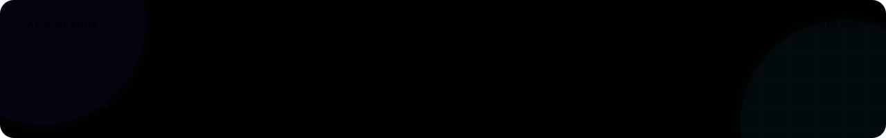

 

  
  &nbsp;
  
  &nbsp;
  
  &nbsp;
  
  &nbsp;
  

  

---

## 🟣 About Me

I'm a **BBIS (Bachelor of Business Information Systems)** finalist at UMT, Lahore (Class of 2026), with a track record spanning **frontend development, business intelligence, enterprise ERP, and data operations**. My work sits at the intersection of technical delivery and business impact — I don't just build things, I build things that *work for the business*.

My capstone — **Artisan Aura Creations** — was selected as one of only 3 projects exhibited at **ICAISAI'26 (HSM–UMT)** and evaluated by industry professionals. That's the bar I hold myself to.

- 🎨 **Frontend** — Production-quality interfaces with HTML5, CSS3, JavaScript, WordPress & Figma
- 📊 **Business Intelligence** — Data pipelines, reporting & dashboards in Power BI, SQL & Oracle DB
- 🏢 **Enterprise Systems** — Full-cycle ERP implementation in Odoo and SAP (Financial & Supply Chain modules)
- 🎬 **Creative Suite** — End-to-end content production with Photoshop, Illustrator, Premiere Pro & After Effects

**Open to:** Frontend Engineering · BI & Data Analysis · ERP/CRM Implementation · Internships · Junior Roles

 

 

## 🤖 System Status

 

## 🟣 Skills

 

## 🟣 Skill Proficiency Scale

 

## 💼 Professional Experience

 

<b>📄 Expand full role details</b>

 

<table width="100%">
<tr>
<td width="30%" valign="top">
  <h3>🎨 Front-End Development Intern</h3>
  <b>Tara Technologies Pvt. Ltd.</b> 
  📍 On-site · Lahore, Pakistan 
  🗓️ Jul 2023 – Sep 2023
    
  
  
  
</td>
<td valign="top">
  Delivered responsive, user-centric interfaces for live client projects, translating high-fidelity designs from <b>Figma</b>, <b>Photoshop</b>, and <b>Illustrator</b> into pixel-perfect, production-ready <b>HTML & CSS</b> — across multiple concurrent projects and tight client deadlines.
    
  Worked inside active <b>Git/GitHub</b> version control workflows — participating in code reviews, resolving merge conflicts, and iterating on UI feedback to consistently deliver cross-browser-consistent builds.
</td>
</tr>

<tr><td colspan="2">
</td></tr>

<tr>
<td width="30%" valign="top">
  <h3>🧑‍💼 Human Resources Intern</h3>
  <b>MGA Industries Pvt. Ltd.</b> 
  📍 On-site · Manga Mandi, Lahore 
  🗓️ Aug 2025 – Sep 2025
    
  
  
  
</td>
<td valign="top">
  Owned the full talent acquisition cycle for a large-scale manufacturing enterprise — from job postings and CV screening through shortlisting, interview coordination, and offer management — cutting time-to-hire through structured, repeatable processes.
    
  Managed new-hire onboarding and maintained audit-ready employee records in <b>Oracle HR</b>. Processed payroll inputs and monitored regulatory compliance, ensuring zero data-integrity issues across all HR records.
</td>
</tr>

<tr><td colspan="2">
</td></tr>

<tr>
<td width="30%" valign="top">
  <h3>🤖 Data Annotation Specialist</h3>
  <b>Nex Pred Solutions</b> 
  📍 Remote · Lahore 
  🗓️ Feb 2026 – Mar 2026
    
  
  
  
</td>
<td valign="top">
  Built and curated production-grade video datasets for computer vision model training — systematically extracting and filtering frames at scale to meet strict dataset quality thresholds.
    
  Executed precise annotation-format conversions between <b>YOLO</b> and <b>COCO</b> schemas, ran structured labeling pipelines in <b>CVAT</b>, and applied rigorous QA validation — directly improving ML model accuracy and training stability across multiple iteration cycles.
</td>
</tr>
</table>

 

## 🟣 Featured Projects

<b>🛍️ Artisan Aura Creations — Sustainable Leather Goods Brand (Odoo ERP)</b>

 

Capstone & conference exhibition project: a direct-to-consumer brand built end-to-end on Odoo ERP, simulating full business operations for an ethically sourced leather goods company. Selected as **1 of 3 projects** exhibited at **ICAISAI'26 (HSM–UMT)** and evaluated by industry professionals.

| Aspect | Details |
|:--|:--|
| **Stack** | Odoo ERP — CRM, HR, Sales, Inventory modules |
| **Scale** | Full-cycle simulated business operations |
| **Workflows** | Procurement · Marketing · Production · HR |
| **Governance** | Role-based access control · Data integrity policies |
| **Impact** | 1 of 3 projects at ICAISAI'26 · Industry-evaluated |
| **Vision** | Scale into a global leader in ethical luxury craftsmanship |
| **Repository** | Available upon request |

Designed end-to-end workflows across procurement, marketing, and production — with a long-term vision of scaling into a global benchmark for responsible, ethically sourced fashion.

<b>🗄️ Student Registration & Library Management Database System</b>

 

An Oracle-based relational database system designed from scratch — conceptual modeling through full physical implementation — covering institution-wide student registration and library operations.

| Aspect | Details |
|:--|:--|
| **Stack** | Oracle Database · ER Modeling |
| **Scale** | Institution-wide registration & library workflows |
| **Processes Covered** | Department allocation · Sectioning · Fee tracking · Eligibility checks |
| **Integrity** | Referential integrity & eligibility validation throughout |
| **Repository** | Available upon request |

Mapped multi-table relationships between students, advisors, instructors, and departments via ER diagrams — validating data accuracy and enforcing system integrity across every registration touchpoint.

 

## 🟣 Awards & Recognition

 

## 📜 Certifications & Professional Development

## 🔥 GitHub Streak Statistics

 

## 🟣 Current Focus

<table>
<tr>
<td align="center">

</td>
<td align="center">

</td>
<td align="center">

</td>
<td align="center">

</td>
</tr>
</table>

