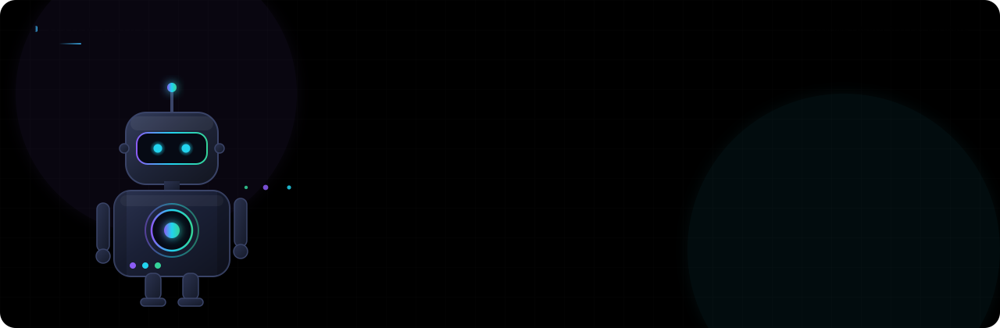

 

  <a href="#about-me"><b>About</b></a> &nbsp;·&nbsp;
  <a href="#what-i-deliver"><b>Services</b></a> &nbsp;·&nbsp;
  <a href="#tech-stack"><b>Stack</b></a> &nbsp;·&nbsp;
  <a href="#professional-experience"><b>Experience</b></a> &nbsp;·&nbsp;
  <a href="#featured-projects"><b>Projects</b></a> &nbsp;·&nbsp;
  <a href="#education--languages"><b>Education</b></a> &nbsp;·&nbsp;
  <a href="#awards--recognition"><b>Awards</b></a> &nbsp;·&nbsp;
  <a href="#certifications"><b>Certifications</b></a> &nbsp;·&nbsp;
  <a href="#get-in-touch"><b>Contact</b></a>

  
  
  
  
  

 

## About Me

I'm a **BBIS (Bachelor of Business Information Systems)** finalist at UMT, Lahore (Class of 2026) with hands-on experience across **frontend development, business intelligence, enterprise ERP, and data operations**. My work sits where technical delivery meets business impact: I don't just build things, I build things that *work for the business*.

My capstone, **Artisan Aura Creations**, was selected as **1 of only 3 projects** exhibited at **ICAISAI'26 (HSM–UMT)** and evaluated by industry professionals. That's the bar I hold myself to.

| | Focus area | What it looks like in practice |
|:--:|:--|:--|
| 🎨 | **Frontend** | Responsive interfaces in HTML5, CSS3, JavaScript, WordPress & Figma |
| 📊 | **Business Intelligence** | Reporting & dashboards in Power BI, SQL & Oracle DB |
| 🏢 | **Enterprise Systems** | ERP implementation in Odoo and SAP (Financial & Supply Chain) |
| 🎬 | **Creative Suite** | Photoshop, Illustrator, Premiere Pro & After Effects |

> **Open to:** Frontend Engineering · BI & Data Analysis · ERP/CRM Implementation · Internships · Junior Roles · Freelance

 

 

## System Status

 

## What I Deliver

 

## Tech Stack

 

 

## Professional Experience

 

<b>📄 Read the full role details (text version)</b>

 

**🤖 Data Annotation Specialist** · *Nex Pred Solutions* · Remote, Lahore · Feb 2026 – Mar 2026
Built and curated production-grade video datasets for computer vision model training, extracting and filtering frames at scale to meet strict quality thresholds. Converted annotations between **YOLO** and **COCO** schemas, ran labeling pipelines in **CVAT**, and applied rigorous QA validation to improve model accuracy and training stability across iteration cycles.

**🧑‍💼 Human Resources Intern** · *MGA Industries Pvt. Ltd.* · Manga Mandi, Lahore · Aug 2025 – Sep 2025
Owned the talent acquisition cycle for a large-scale manufacturing enterprise: job postings, CV screening, shortlisting, interview coordination and offer management. Handled new-hire onboarding, maintained audit-ready employee records in **Oracle HR**, processed payroll inputs and monitored regulatory compliance.

**🎨 Front-End Development Intern** · *Tara Technologies Pvt. Ltd.* · Lahore · Jul 2023 – Sep 2023
Delivered responsive, user-centric interfaces for live client projects, translating high-fidelity designs from **Figma**, **Photoshop** and **Illustrator** into production-ready **HTML & CSS**. Worked inside **Git/GitHub** workflows: code reviews, merge conflicts and iterative UI feedback to deliver cross-browser-consistent builds.

 

## Featured Projects

 

<b>🛍️ Artisan Aura Creations: project details</b>

 

| Aspect | Details |
|:--|:--|
| **Stack** | Odoo ERP: CRM, HR, Sales, Inventory and more |
| **Scale** | Full-cycle simulated business operations |
| **Workflows** | Procurement · Marketing · Production · HR |
| **Governance** | Role-based access control · Data-integrity policies |
| **Impact** | 1 of 3 projects at ICAISAI'26 · Industry-evaluated |
| **Vision** | Scale into a global leader in ethical luxury craftsmanship |
| **Repository** | Available upon request |

<b>🗄️ Student Registration & Library Management Database: project details</b>

 

| Aspect | Details |
|:--|:--|
| **Stack** | Oracle Database · ER Modeling |
| **Scale** | Institution-wide registration & library workflows |
| **Processes covered** | Department allocation · Sectioning · Fee tracking · Eligibility checks |
| **Integrity** | Referential integrity & eligibility validation throughout |
| **Repository** | Available upon request |

 

## Education & Languages

 

## Awards & Recognition

 

## Certifications

 

## GitHub Activity

 

## Current Focus

 

## Get in Touch

 

<table>
<tr>
<td align="center"></td>
<td align="center"></td>
</tr>
<tr>
<td align="center"></td>
<td align="center"></td>
</tr>
</table>

 

